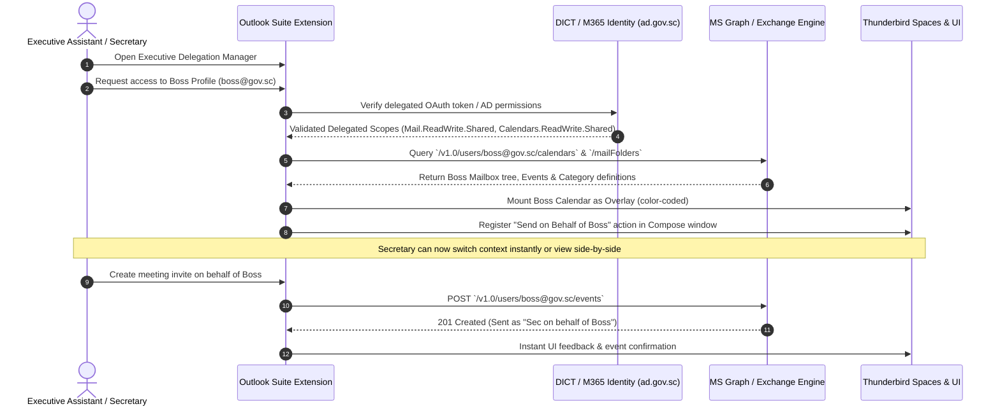

# Enterprise Architecture Specification (Artifact Version 01.01)
**Artifact ID:** `01.01_enterprise_architecture_specification.md`  
**Timestamp:** 2026-09-27T12:47:00+04:00  
**Authority:** Government of Seychelles — Department of Information Communications Technology (DICT)  
**Standard Compliance:** ISO/IEC 27001:2022, ISO/IEC 27701:2019, Seychelles DPA 2023  

---

## 1. System High-Level Topology

```
+----------------------------------------------------------------------------------------------------+
|                                    Mozilla Thunderbird 128+ ESR                                   |
|                                                                                                    |
|  +---------------------+  +---------------------+  +---------------------+  +-------------------+  |
|  |     Spaces Rail     |  |    Mail / 3-Pane    |  | Calendar / FreeBusy |  |  People / GAL     |  |
|  | (Mail/Cal/Task/Note)|  | (Focused/Categories)|  | (Scheduling Assist) |  | (CardDAV/Graph)   |  |
|  +----------+----------+  +----------+----------+  +----------+----------+  +---------+---------+  |
|             |                        |                        |                       |            |
|             +------------------------+-----------+------------+-----------------------+            |
|                                                  |                                                 |
|                                     [ WebExtension UI Layer ]                                      |
|                            (Vanilla TypeScript + Supernova Tokens)                                 |
+--------------------------------------------------+-------------------------------------------------+
                                                   |
                     +-----------------------------+-----------------------------+
                     |                                                           |
+--------------------+------------------------------------+  +-------------------+-------------------+
|             MailExtension Standard APIs                 |  |      WebExtension Experiment Layer    |
|   (messenger.accounts, folders, messages, tabs, etc.)   |  |  (spacesBridge, calendarBridge,       |
|                                                         |  |   addressBookBridge, authVault)       |
+--------------------+------------------------------------+  +-------------------+-------------------+
                     |                                                           |
                     +-----------------------------+-----------------------------+
                                                   |
+--------------------------------------------------v-------------------------------------------------+
|                               Core RAII Delta Sync & Storage Engine                                |
|  - Offline-First Local Cache (IndexedDB Dexie.js / WASM SQLite OPFS)                                |
|  - Delta Query Change Tracking (@odata.deltaLink / CalDAV sync-collection)                         |
|  - Explicit Resource Management (Symbol.dispose / Symbol.asyncDispose)                             |
+--------------------------------------------------+-------------------------------------------------+
                                                   |
                     +-----------------------------+-----------------------------+
                     |                                                           |
                     v                                                           v
+------------------------------------+                      +------------------------------------+
|     Microsoft 365 Graph Layer      |                      |       Open Standards Protocol      |
| - OAuth2 / MSAL PKCE Flow          |                      | - CalDAV (RFC 4791, RFC 5545)      |
| - Mail, Events, To-Do, OneNote/Note|                      | - CardDAV (RFC 6352, RFC 6350)     |
| - Categories, Rules, OOF Assistant |                      | - IMAP Extensions & Notes Storage  |
| - Global Address List (GAL) Lookup |                      | - RFC 6186 Service Autodiscovery   |
+------------------------------------+                      +------------------------------------+
```

---

## 2. Executive Delegation ("Secretary" / Boss Workflow)


