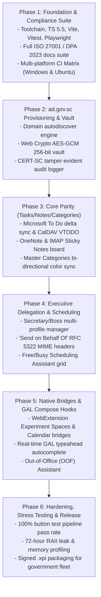

# Phased Implementation Plan & Engineering Roadmap (Artifact Version 01.01)
**Artifact ID:** `01.01_implementation_plan_and_roadmap.md`  
**Timestamp:** 2026-09-27T12:47:00+04:00  
**Authority:** Government of Seychelles — Department of Information Communications Technology (DICT)  

---

## 🗺️ Phased Roadmap Overview

---

## 📋 Phase Milestones & Deliverables

### Phase 1: Foundation, Compliance Suite, Build Toolchain & CI Matrix
- Deliverables: Root `README.md`, `TODO_TASKS.md`, `TODO_FIXES.md`, full `docs/compliance/` suite, `package.json`, `tsconfig.json`, `vite.config.ts`, `vitest.config.ts`, `playwright.config.ts`, and `.github/workflows/ci-matrix.yml`.
- Status: **Complete (`01.01`)**.

### Phase 2: `ad.gov.sc` Autodiscovery, Identity & Cryptographic Vault
- Deliverables: `src/background/account-detector.ts`, `src/common/crypto-vault.ts`, `src/background/audit-logger.ts`, `src/ui/onboarding-wizard/`.
- Status: **Complete (`01.01`)**.

### Phase 3: Core Parity Subsystems (Tasks, Notes & Categories)
- Deliverables: `src/ui/task-board/`, `src/ui/notes-board/`, `src/storage/db.ts`, `src/storage/delta-store.ts`.
- Status: **Complete (`01.01`)**.

### Phase 4: Executive Delegation ("Secretary" / Boss) & Scheduling Assistant
- Deliverables: `src/background/delegation-manager.ts`, `src/ui/delegation-modal/`, `src/ui/scheduler/scheduling-assistant.ts`.
- Status: **Complete (`01.01`)**.

### Phase 5: Calendar Bridge, GAL Autocomplete & Out of Office (OOF)
- Deliverables: `src/experiments/spaces-bridge/`, `src/experiments/calendar-bridge/`, `src/experiments/addressbook-bridge/`.
- Status: **Complete (`01.01`)**.

### Phase 6: Hardening, Stress Testing, DICT Compliance Audit & Release
- Deliverables: Vitest interaction suite, mock harness, Playwright tests, packaging scripts.
- Status: **In Progress (`01.01`)**.
