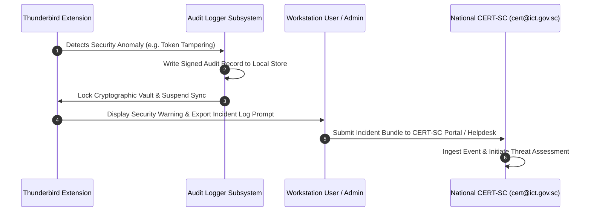

# National CERT-SC Incident Reporting & Audit Telemetry Protocol
## Cybersecurity Incident Management Specification

**Organization:** Government of Seychelles — Department of Information Communications Technology (DICT)  
**Coordinating Body:** National Computer Emergency Response Team (CERT-SC)  
**Incident Contact:** `cert@ict.gov.sc` / `https://cert.gov.sc`  

---

## 1. Role of CERT-SC & Incident Taxonomy

The **National Computer Emergency Response Team of Seychelles (CERT-SC)** was established under DICT to monitor national cybersecurity posture, coordinate vulnerability disclosure, and provide incident response services for Government of Seychelles infrastructure.

The extension implements a structured audit logging and event capture engine (`src/background/audit-logger.ts`) capable of generating standard incident bundles formatted for rapid CERT-SC ingestion.

---

## 2. Event Classification & Severity Thresholds

| Severity | Event Type | Trigger Condition | Automated Extension Action |
| :--- | :--- | :--- | :--- |
| **CRITICAL (Level 1)** | `AUTH_TOKEN_TAMPERING` | Decryption failure of encrypted token store with invalid MAC or corrupted nonce. | Wipe active tokens from RAM; lock vault; log critical security event. |
| **CRITICAL (Level 1)** | `UNAUTHORIZED_DELEGATION` | Attempt to access boss mailbox without valid server-side delegation scope. | Deny access; invalidate delegate cache; generate security alert. |
| **WARNING (Level 2)** | `TLS_CERTIFICATE_MISMATCH` | Host TLS certificate validation failure or man-in-the-middle suspicion. | Abort connection immediately; notify user; log endpoint details. |
| **WARNING (Level 2)** | `RATE_LIMIT_EXCEEDED` | Server returns HTTP 429 across multiple backoff intervals (> 5 retries). | Pause background polling; throttle requests; log rate-limit event. |
| **INFO (Level 3)** | `DELEGATED_ACTION_EXEC` | Secretary sends an email or creates calendar invite on behalf of boss. | Record non-repudiation audit entry (Principal, Delegate, Action, Time). |
| **INFO (Level 3)** | `PROFILE_ONBOARDING` | User successfully configures a new `ad.gov.sc` profile. | Record successful setup timestamp and autodiscovered endpoint type. |

---

## 3. Structured Audit Log Schema (JSONL)

Audit entries generated by `audit-logger.ts` adhere to the following schema:

```json
{
  "$schema": "https://cert.gov.sc/schemas/audit-event-v1.json",
  "eventId": "evt_01HZX89AB76CDE1234",
  "timestamp": "2026-09-27T08:44:00.123Z",
  "facility": "thunderbird-outlook-suite",
  "version": "1.0.0",
  "severity": "INFO",
  "category": "DELEGATED_ACTION_EXEC",
  "actor": {
    "accountEmail": "jane.doe@ad.gov.sc",
    "role": "EXECUTIVE_SECRETARY"
  },
  "principal": {
    "accountEmail": "minister.office@ad.gov.sc",
    "role": "SENIOR_OFFICIAL"
  },
  "action": "CREATE_CALENDAR_EVENT",
  "details": {
    "eventId": "msg_987654321",
    "subject": "National Cybersecurity Coordination Briefing",
    "startTime": "2026-09-28T09:00:00Z"
  },
  "integrityHash": "e3b0c44298fc1c149afbf4c8996fb92427ae41e4649b934ca495991b7852b855"
}
```

---

## 4. Incident Escalation & Response Flow


