# Cryptographic Key Management & Token Protection Specification
## Technical Specification for Web Crypto Storage Engine

**Organization:** Government of Seychelles — Department of Information Communications Technology (DICT)  
**Standard Reference:** ISO/IEC 27001:2022 Control A.8.24 / NIST SP 800-38D  
**Module:** `src/common/crypto-vault.ts`  

---

## 1. Architectural Overview

To prevent credential theft or unauthorized access to Microsoft 365 / Exchange tokens stored on client machines, the extension employs the browser's native **W3C Web Crypto API (`window.crypto.subtle`)**.

All authentication secrets, OAuth2 refresh tokens, and delegate session credentials are encrypted with authenticated symmetric cryptography prior to being committed to IndexedDB.

---

## 2. Cryptographic Primitives & Parameters

```
+------------------------------------+---------------------------------------------------------------+
| Parameter                          | Value & Rationale                                             |
+------------------------------------+---------------------------------------------------------------+
| Symmetric Encryption Algorithm    | AES-GCM (Galois/Counter Mode, 256-bit key)                    |
| Authentication Tag Length         | 128-bit (16 bytes) for strong integrity protection            |
| Initialization Vector (IV/Nonce)   | 96-bit (12 bytes) cryptographically random per operation      |
| Key Derivation Function (KDF)     | PBKDF2 (Password-Based Key Derivation Function 2)             |
| KDF Hash Function                 | SHA-256                                                       |
| KDF Iteration Count               | 100,000 minimum iterations                                    |
| Salt Length                       | 128-bit (16 bytes) randomly generated per vault initialization|
| Key Exportability                 | Non-extractable (`extractable: false`) where supported        |
+------------------------------------+---------------------------------------------------------------+
```

---

## 3. Encryption & Decryption Pipeline

```mermaid
graph TD
    subgraph Encryption_Pipeline ["Secret Encryption Pipeline"]
        Plaintext["Plaintext OAuth Token / Credential"]
        Salt["16-byte Cryptographic Salt"]
        Passphrase["User Device Secret / Hardware Entropy"]
        
        PBKDF2["PBKDF2 Key Derivation (100k rounds, SHA-256)"]
        Passphrase & Salt --> PBKDF2
        PBKDF2 --> MasterKey["AES-GCM 256-bit Key"]
        
        IV["Random 12-byte Nonce (crypto.getRandomValues)"]
        Plaintext & MasterKey & IV --> AES_GCM_Encrypt["AES-GCM Encryption"]
        AES_GCM_Encrypt --> CiphertextEnvelope["Encrypted Envelope<br/>{ iv, salt, ciphertext, tag }"]
        CiphertextEnvelope --> IndexedDB["IndexedDB (Dexie.js Storage)"]
    end

    subgraph Decryption_Pipeline ["Secret Decryption Pipeline"]
        StoredEnvelope["Stored Envelope from DB"]
        ExtractData["Extract IV, Salt & Ciphertext"]
        StoredEnvelope --> ExtractData
        
        DeriveKey["Derive AES-GCM Key (PBKDF2 with Stored Salt)"]
        ExtractData --> DeriveKey
        
        AES_GCM_Decrypt["AES-GCM Decryption & Tag Verification"]
        ExtractData & DeriveKey --> AES_GCM_Decrypt
        AES_GCM_Decrypt --> ValidatedToken["Decrypted Plaintext Token in Memory"]
    end
```



---

## 4. Key Lifecycle & Destruction

1. **Generation**: The master salt is generated during the first run using `crypto.getRandomValues(new Uint8Array(16))`.
2. **Ephemeral In-Memory Lifecycle**: Decrypted plaintext tokens are kept in scoped memory variables during active API calls and wiped upon reference discard.
3. **Destruction & Wipe**: Triggering the "Purge Local Profile Cache" button permanently removes both the ciphertext envelopes and the salt record, making prior encrypted data mathematically unrecoverable.
